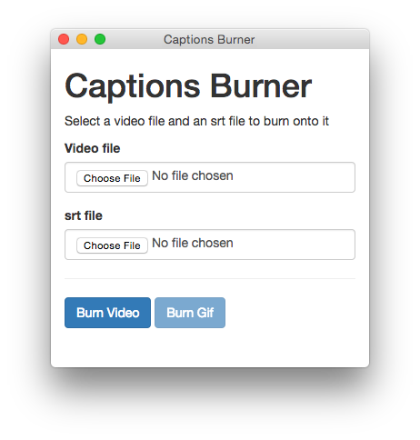

# Captions Burner

A small os x app to burn srt file captions onto a video.




## Development

The app uses, NWJS, ffmpeg fluent-ffmpeg and is packaged with a binary of ffmpeg for os x.

```
npm install
```

you might need to install `npm install nw -g`

```
npm start
```


## Deployment

Use deploy script

```
node deploy.js
```

This creates a build folder inside the repo. The build folder is also in `.gitignore` to avoid accidentally pushing it to remote.

## Packaged app ready for use

See [release section](https://github.com/voxmedia/captions_burner/releases)
